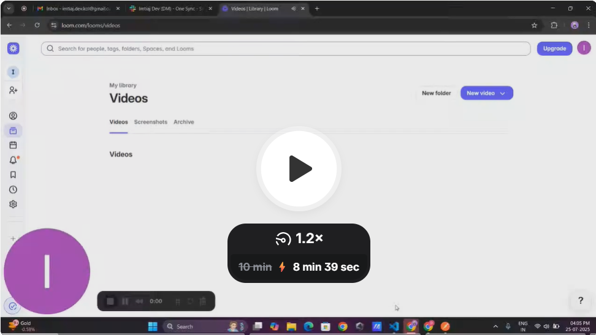

# 📦 OneSync - Email Aggregator

OneSync is a powerful onebox email aggregator that supports multiple account syncing, advanced AI-based classification, full-text search, and integrations.

This repository contains both the **frontend** and **backend** code for the OneSync project.

---

## 🚀 Project Overview

OneSync enables users to:

* Sync emails in real time from multiple inboxes using IMAP
* Store and search emails using Elasticsearch
* Categorize emails into AI-powered labels like "Interested", "Meeting Booked", etc.
* Trigger integrations like Slack/webhook on specific categories
* View, search, and filter emails from a beautiful frontend UI

---

## 📽️ Watch Demo

[](https://www.loom.com/share/c00291a75d6248658ba33476b1b07c38?sid=e0b5ae5d-f81b-4404-9bd4-3880e90ce450)

---

## 📁 Directory Structure

```bash
.
├── backend/         # FastAPI backend
├── frontend/        # Next.js frontend
└── README.md        # Root Readme (this file)
```

---

## 🛠 How to Run the Project

### 1. Clone the repository

```bash
git clone https://github.com/imtiaj-007/One-Sync.git
cd One-Sync
```

### 2. Start Elasticsearch (for search & categorization)

```bash
docker run -p 9200:9200 -e "discovery.type=single-node" elasticsearch:9.0.4
```

### 3. Run Backend

```bash
cd backend
npm install
npm run dev
```

### 4. Run Frontend

```bash
cd frontend
npm install
npm run dev
```

Visit: [http://localhost:3000](http://localhost:3000)

---

## ✅ Completed Features

### 1. **Real-time IMAP Email Sync**

* Syncs last 30 days of emails from 2 accounts using IMAP IDLE mode

### 2. **Elasticsearch Email Storage & Search**

* Emails are indexed for full-text search
* Advanced search APIs support filters for inbox, label, sender, and query text

### 3. **AI Email Categorization**

* Categorizes into: Interested, Meeting Booked, Not Interested, Spam, Out of Office
* Uses Gemini-Pro with prompt engineering

### 4. **Slack & Webhook Integration**

* For emails labeled "Interested", sends notifications to Slack + external webhook

### 5. **Frontend Interface**

* Built with Next.js, Zustand, Shadcn UI, TailwindCSS
* Inbox filter, AI category filter, keyword search
* Beautiful table-based layout using shadCN components

---

## 📑 Refer to Child Readmes

For detailed setup and usage instructions:

* [`/frontend/README.md`](./frontend/README.md) — UI, structure, features
* [`/backend/README.md`](./backend/README.md) — IMAP, search, AI categorization, integrations

---

## 👨‍💻 Author

**SK Imtiaj Uddin**
Built for the ReachInbox Backend Engineering Assignment ✅
